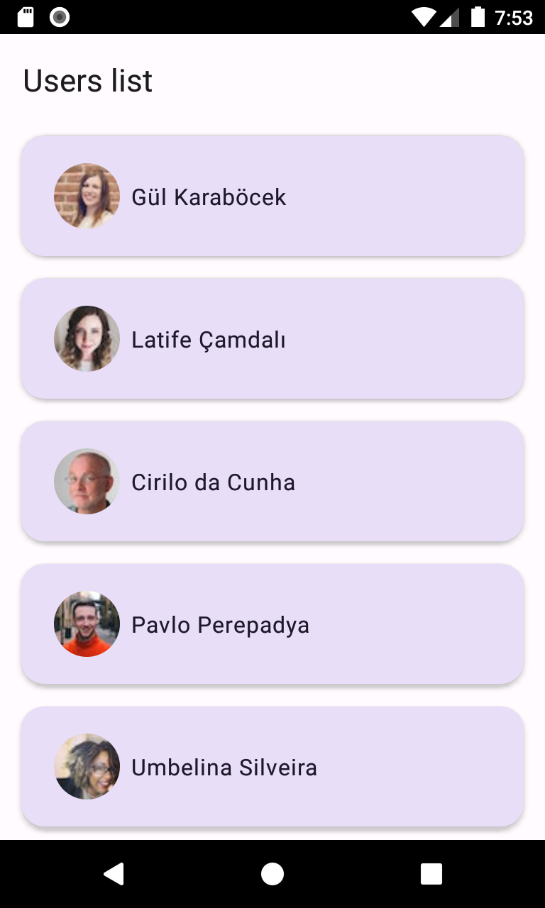

# RandomUser

  

## Project

Android application showing users from the open API randomuser.me

This project is following the MVVM architecture combined with Single activity architecture and
multi-modules.

The randomuser.me Api allow developers to get random users, which can be GET by page.

this project has been realized with a week time limit.

## Setup

This project has been developed and created with Android Studio Flamingo | 2022.2.1 and is actually
using the embedded jdk, which is using Java 17 so check your android studio configuration before
trying to build the project.

## Libraries

This project is using the following Libraries:

- **Hilt**: Dependency injection library built on top of Dagger.
- **Navigation Component**: Jetpack library that provides navigation between Fragments
  navigation graph.
- **Lifecycle**: Jetpack library used for my MVVM implementation to handle actions in response to a
  change in the Lifecycle status.
- **Retrofit**: Http client library.
- **Landscapist Glide**: Image loading library implementing composable to display Image using
  Glide (Contains an internal version of Glide so no need to import it)
- **Compose and Material3**: Jetpack Compose to display the UI and handling states
- **Room**: Database library
- **RxJava3** : Asynchronous Library
- **Timber**: Logging library
- **Junit4**: Testing Library

## Screenshots

## Development

The project has been develop following a MultiModules design. With
:app : handling Application and MainActivity -> redirect to Home fragment by navigation graph
:features : containing two modules

- :home : containing one fragment displaying the user list and a ViewModel used to retrieve the data
  issued by the followed module -> implement :User
- :user : displaying the UserDetailsFragment and containing all business around User data

:core : containing three modules

- :core_common: main core modules serving as main api for library dependency and utils
- :core_ui: containing general Ui Components such as shared composable and abstract classes
- :core_network: containing tools for networking

The :app module is implement the dependency injection and containing the application and
MainActivity.

I tried to do my own implementation of page data retrieval, alongside local database storing and
display when the user does not have a network connection.

## Design

Chosen colors:

- For the colors I used the material theme
  builder [ThemeBuilder](https://m3.material.io/theme-builder#/dynamic) which provide both light and
  dark mode theme

For all icons I used the ones provided by android studio.

For the visuals I tried to make something clear and simple. I tried to show all the

## Tests

I've made test to test the parsing of the data. Theses tests can be found in the :app module

## What to improve ?

- Try to implement RxRemoteMediator, I didn't have enough time to correctly implement it and
  also improving the handling of paging for local database
- More tests
- Probably remove the Fragment/Compose pattern and only use Compose for better performance
- Handling the api in a better way by storing a seed and only use seed to get data. This will allow
  a better page handling and remove all the database clear that can be avoided.
- Add intent to redirect to call or maps when clicking on these items